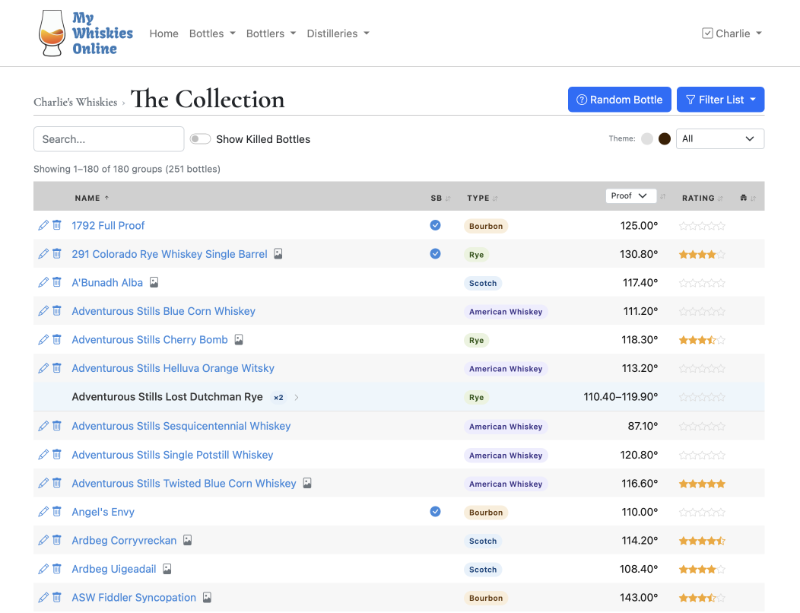
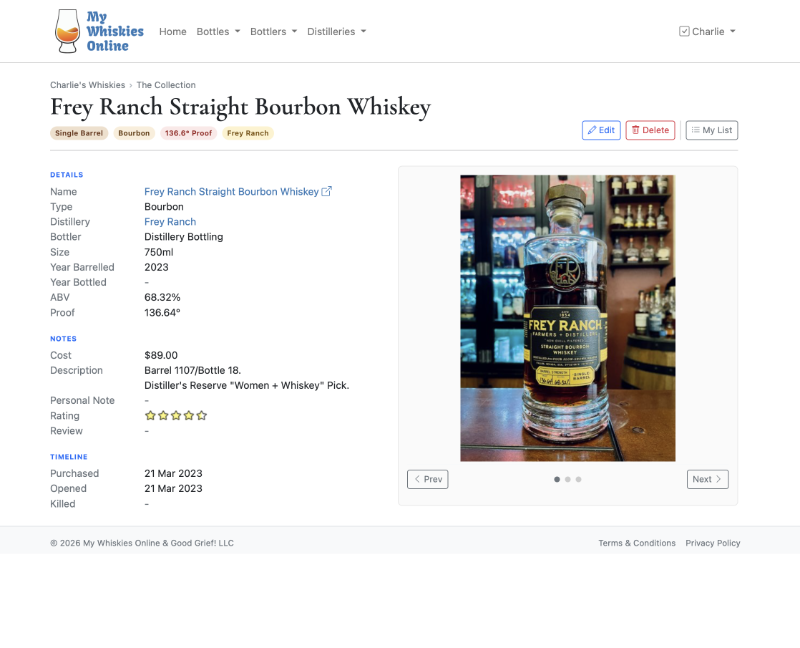

# My Whiskies Online

A personal whiskey collection tracker built by a whiskey geek who is also a Python geek.

After a couple of years of collecting, a spreadsheet stopped cutting it. I wanted something that could handle
tasting notes, bottle images, distillery info — and a randomizer for those nights when staring at the shelf
isn't helping. I threw together a quick local script, posted some screenshots to a few whiskey groups, and
enough people were interested that it turned into a proper web app.

The live version is at [my-whiskies.online](https://www.my-whiskies.online). See it in action at
[my-whiskies.online/charlie](https://www.my-whiskies.online/charlie), and register to track your own
collection if you'd like.

## What it does

- Track bottles in your collection, including distillery, bottler, ABV, age, tasting notes, and photos
- Mark bottles as killed (finished) and keep them in your history
- Random bottle picker — useful when you can't decide what to pour
- Public and private bottle visibility

## Tech stack

- **Python / Flask** — application framework
- **SQLAlchemy / MySQL** — ORM and database
- **Bootstrap** — frontend styling
- **AWS S3** — image storage
- **Hosted on EC2**

## License

MIT
